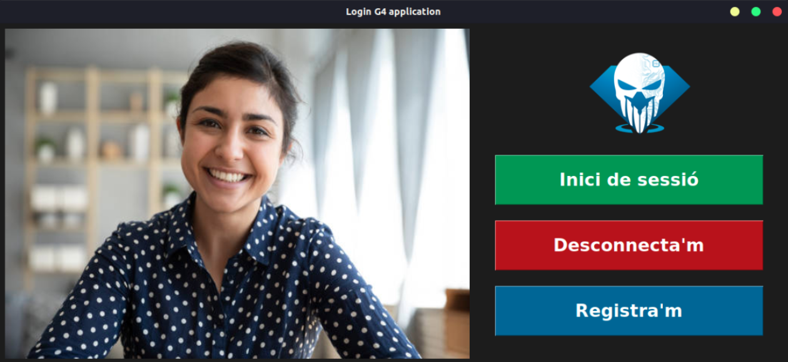
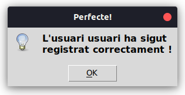
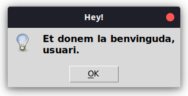
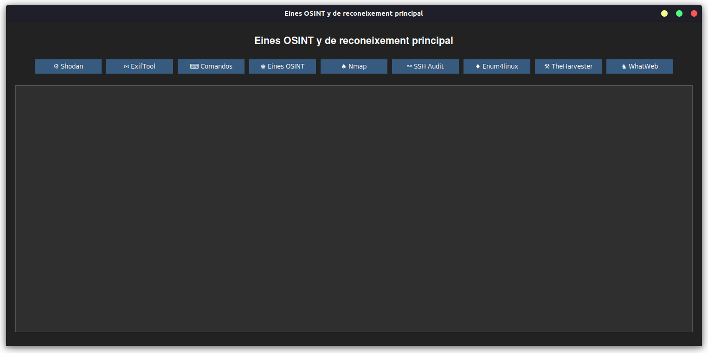
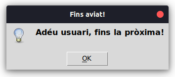

<h1 align="center">PROJECTE 2 ASIX-MP14 GRUP 4</h1>
<p align="center">Projecte realitzat per 
    <a href="https://github.com/arnauserrasoriano" target="_blank">Arnau Serra</a>, 
    <a href="https://github.com/sleshchuc" target="_blank">Svyatoslav Leshchuck</a> i 
    <a href="https://github.com/lluclopeziesebre" target="_blank">Lluc López</a>.
</p>

<p align="center"></p>


# 🧪 Instal·lació de la aplicació

<details>
<summary>Clica'm per a veure el procés d'instal·lació</summary>

## Instal·lació de les eines clau per al desenvolupament del software
```bash
sudo apt install git python3-pip python3-tk cmake -y
```
## Copiar el repositori de GitHub

```bash
git clone https://github.com/sleshchuc/Login_Reconeixement_Facial/; cd Login_Reconeixement_Facial
```

## Instal·lar les dependencies
```bash
pip install -r requirements.txt -v
```

## Execució del programari
```bash
python3 login/main_login.py
```
</details>

<br>

# 📖 Guia d'ús bàsic

**1. Registrar usuari**
<p align="center"></p>

<p align="center"></p>

<p align="center"></p>

<p align="center"></p>

<p align="center"></p>

**2. Iniciar sessió**
<p align="center"></p>

<p align="center"></p>

<p align="center"></p>

<p align="center"></p>


**3. Tancar aplicació**
<p align="center"></p>

<p align="center"></p>

<p align="center"></p>

<p align="center"></p>

<p align="center"></p>


# 💡 Consells i Trucs
[Instal·lar les dependencies](#installar-les-dependencies)
> [!TIP]
> La instal·lació de la llibreria dlib pot ser lenta, ja que el temps de descàrrega depèn de la memòria de l’equip. Per això, es recomana instal·lar-la amb el paràmetre -v per seguir el progrés de la descàrrega.