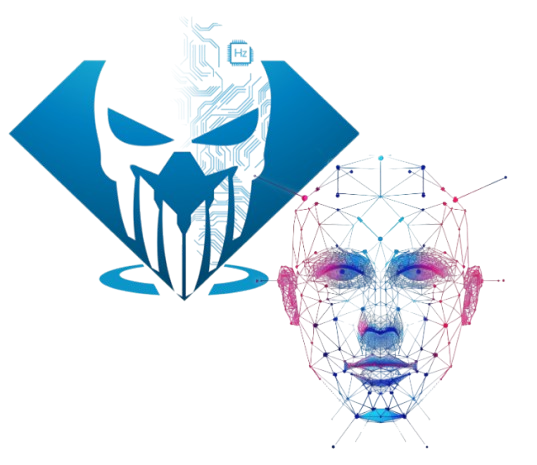

<h1 align="center">PROJECTE 2 ASIX-MP14 GRUP 4</h1>

Projecte realitzat per 
    <a href="https://github.com/arnauserrasoriano" target="_blank">Arnau Serra</a>, 
    <a href="https://github.com/sleshchuc" target="_blank">Svyatoslav Leshchuck</a> i 
    <a href="https://github.com/lluclopeziesebre" target="_blank">Lluc López</a>.

## 🧪 Instal·lació de la aplicació

1. sudo apt install git python3-pip python3-tk cmake -y
2. git clone https://github.com/sleshchuc/Login_Reconeixement_Facial/; cd Projecte_2-Login_Reconeixement_Facial
3. pip install -r requirements.txt -v
> [!TIP]
> El paràmetre blaskdnj
4. python3 login/main_login.py

## 📖 Guia d'ús bàsic
